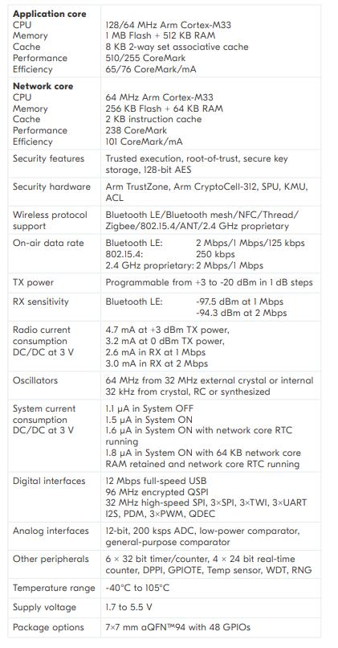

# [nRF5340](https://github.com/SoCXin/nRF5340)

* [nordicsemi](https://www.nordicsemi.com/)：[Cortex-M33](https://github.com/SoCXin/Cortex)
* [L4R5](https://github.com/SoCXin/Level)：(64+128) MHz * 1.50 DMIPS/MHz (510+238CoreMark)

## [简介](https://github.com/SoCXin/nRF5340/wiki)

[nRF5340](https://github.com/SoCXin/nRF5340) 基于Arm®Cortex®-M33双核处理器;

### 关键特性

* Dual-core
* BLE 5.2, NFC, Thread and Zigbee
* NFC
* 1.7-5.5 V
* 宽温度范围-40 - 105°

#### 封装规格

* BGA176 (10×10mm)

### [选型建议](https://github.com/SoCXin)

[nRF5340](https://github.com/SoCXin/nRF5340)

### [探索芯世界 www.SoC.xin](http://www.SoC.Xin)
